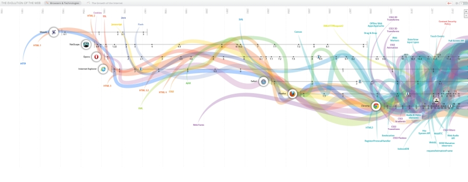

# notatki-z-wykladow



ewolucja Internetu

http://www.evolutionoftheweb.com/

programy do tworzenia "okien na swiat":

JavaScript
CSS
HTML (jezyk znacznikow)

20% tekstow jest generowane przez komputery

drzewo programu

znaczniki np. H1 

##HTML

http://software.hixie.ch/utilities/js/live-dom-viewer/

https://jsfiddle.net/

http://jsbin.com/?html,output

http://sass-lang.com/

http://jupyter.org/

https://www.firebase.com/ (logowac sie mozna przez googla i mozna znalezc WBzyl ze zdjeciem gor)

https://www.wolframalpha.com/


http://wbzyl.inf.ug.edu.pl/

http://tao.inf.ug.edu.pl/


Kod w C:

```c
#include <stdio.h>
int main() {
  printf("witaj świecie\n");
  return 0;
}
```

http://wbzyl.github.io/ - strona p. W. Bzyl


{
  "type": "FeatureCollection",
  "features": [
    { 
      "type" : "Feature", 
      "geometry" : { 
        "type" : "Point", 
        "coordinates" : [ 18.57327, 54.39591 ] 
      }, 
      "properties" : { 
        "title" : "Instytut Informatyki, UG", 
        "description" : "building", 
        "marker-size" : "medium", 
        "marker-symbol" : "building" 
      } 
    }
  ]
}


# 16 kwietnia 2016 wykład

http://polskikursblendera.pl/ - przykład strony w wordpresie - starać się nie produkować takiego badziewia ;-) to rodzaj gotowca
tutoriale podstawowe, średnio trudne, zaawansowane...

https://mat.ug.edu.pl/ - przykład strony napisanej

zrobić jakąś fajną stronę, może być wizytówka o sobie, albo z przepisami, albo jak podróżować z dziećmi

responsywna strona to taka która jest widoczna dobrze również na telefonie

warto trzymać stronę w chmurze, może być w GitHabie

problemy:
komunikacja z tym co jest w chmurze
iCloud - np konto na Aple i tam ktoś może mieć w folderach rzeczy

terminal/github desktop - z linii poleceń

gitlab.com podobny do GitHub, można mieć repozytoria prywatne albo je upubliczniać

ssh czyli secure shell - generujemy dwa klucze: prywatny i publiczny
tao.inf.ug.edu.pl
http://wbzyl.inf.ug.edu.pl/sp/unix-commands

dograć samemu te dwie rzeczy, które tych dwóch ludzi wymyśliło

bezpiecne klucze i inne zabezpieczenia


menu rozwijane
ul - lista nienumerowana

li - 

class

potrzebujemy css

kaskadowa arkusze stylów

http://wbzyl.inf.ug.edu.pl/rails2/ti/css-basics

http://wbzyl.inf.ug.edu.pl/rails2/ti

można zainstalować przeglądarkę w wersji development i zobaczyć czy strona prawidłowo się wyświetla

dołożyć ramki

ramkologia:

https://www.w3.org/TR/css3-border/

https://css-tricks.com/almanac/properties/b/border-image/ - inne ramki, serwetka np.


## 14 maja 2016r wykład

Java Script - język programowania

Jou Don't Know JS - książki z instrukcjami

https://github.com/getify/You-Dont-Know-JS/blob/master/README.md

https://github.com/getify/You-Dont-Know-JS/blob/master/up%20&%20going/ch1.md

about:blank pusta strona do ćwiczeń

ustawienia -> więcej narzędzi -> narzędzia dla programistów ->Console

js - na konsoli - wpisujemy node

operatory np. b=(a=2)

funkcje np. function formatAmount()

Scope - zasięg, zmienna w funkcji niewidoczna poza funkcją

funkcje, które tworzą funkcje

http://railsgirls.com/tricity - można było się zapisać na naukę programowania dla pań

http://ragnarson.com/

https://textio.com/ - zbiór ofert pracy

http://www.colourlovers.com/ - świetna strona z kolorami!
